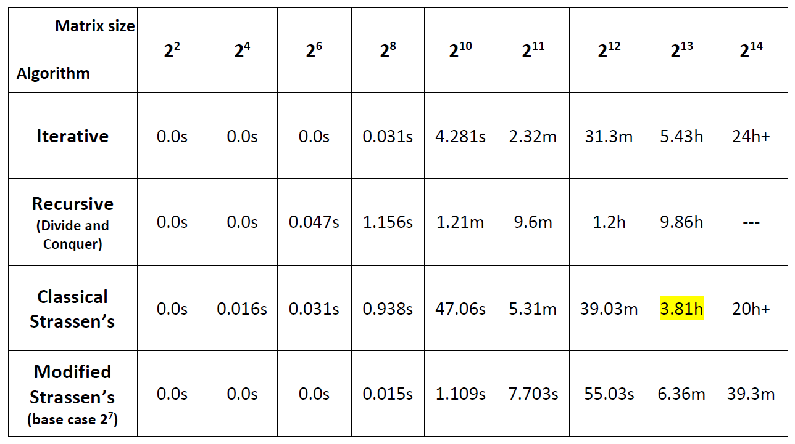

## Different matrix multiplication methods analyzed.

All tests were carried out on a Microsoft Azure virtual machine with the following specifications:  
**Processor:** Intel Xeon CPU E5-2673 v4 @ 2.30GHz.  
**RAM:** 32.0 GB DDR4.  
**Windows edition:** Windows Server 2016 Datacenter.  
**System type:** 64-bit Operating System, x64 based processor.  
**Java JDK version:** 1.8.0_191.  

## Analysis results

